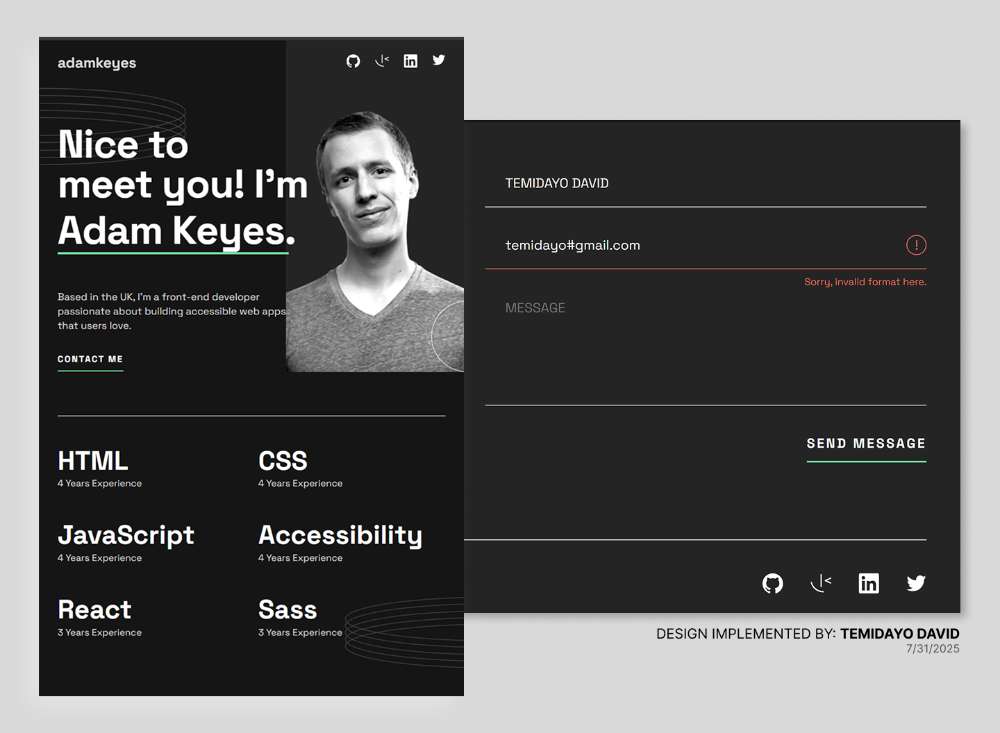

# Frontend Mentor - Single-page developer portfolio solution

This is a solution to the [Single-page developer portfolio challenge on Frontend Mentor](https://www.frontendmentor.io/challenges/singlepage-developer-portfolio-bBVj2ZPi-x). Frontend Mentor challenges help you improve your coding skills by building realistic projects. 

## Table of contents

- [Overview](#overview)
  - [The challenge](#the-challenge)
  - [Screenshot](#screenshot)
  - [Links](#links)
- [My process](#my-process)
  - [Built with](#built-with)
  - [What I learned](#what-i-learned)
  - [Continued development](#continued-development)
  - [Useful resources](#useful-resources)
- [Author](#author)
- [Acknowledgments](#acknowledgments)

**Note: Delete this note and update the table of contents based on what sections you keep.**

## Overview

### The challenge

Users should be able to:

- Receive an error message when the `form` is submitted if:
  - Any field is empty
  - The email address is not formatted correctly
- View the optimal layout for the interface depending on their device's screen size
- See hover and focus states for all interactive elements on the page

### Screenshot

### Links

- Solution URL: (https://github.com/TemidayoDavid/Single-page-portfolio-design)
- Live Site URL: (https://temidayodavid.github.io/Single-page-portfolio-design/)

## My process

- I examined the provided design figma files.

- I decided to build with SASS.

- I researched working with SASS, best practices and organisation of directory.

- Wrote the structure of the page in HTML

- Defined all varaibles and partials

- Built all layouts, and implementing the design

### Built with

- Semantic HTML5 markup
- SASS
- Flexbox
- CSS Grid
- Mobile-first workflow
- JavaScript

### What I learned

I learnt how to use SASS for the first time. Some of the old sass syntax had been deprecated, so i had to learn the @use and @forward methods to set up my SASS file. I learnt how to use @mixins, to pass variables and to properly arrange the directory for a seamless development.

I also learnt how to use SASS partials and how to properly pass them without the ambiguity of repetition. A solution was to use the _index.scss partial file and pass all the other partials to it and then plug it to the main.scss and making it available everywhere useing the asterik "*"

I learnt to generate a build file and deploy it. Here was the process 

**bash**

`npm install --save-dev gh-pages`

---

**json**

`"scripts": {
  "build": "parcel build src/index.html --dist-dir dist",   *this is the script to buld*
  "deploy": "gh-pages -d dist"   *this deploys the dist folder to github pages*
}
`

---

**bash**

`npm run build`
`npm run deploy`

After this, i then adjusted the path in the dist folder to relative ones so that the css and js files could properly render.

### Continued development

I definitely would be delving deeper in understanding how SASS partials work, functions and even mixins with media-queries. I was quite uncomfortable with knowing which styles to mix, which to allow and other methods that would have been easier to use.

In subsequent problems, i not only plan on using SASS but i plan on experimenting with other features that would make my code cleaner and more readable.

### Useful resources

- [LEARNING TO USE SASS](https://www.youtube.com/watch?v=_a5j7KoflTs&ab_channel=freeCodeCamp.org) - This helped me for understand the idea behind sass and had a very beginner friendly example.

- [USING @USE AND @FORWARD](https://www.youtube.com/watch?v=CR-a8upNjJ0&list=PL4-IK0AVhVjMYRhK9vRPatSlb-9r0aKgh&index=6&ab_channel=KevinPowell) - This helped me use a more current method of working with SASS. The @import was now deprecated and Kevin gives a breakdown on using the newer @use and @forward.

- [GRIDS](https://www.youtube.com/watch?v=rg7Fvvl3taU&t=152s&ab_channel=KevinPowell) - Grids can be a headache, this helped me understand grid areas.

- [CONQUERING RESPONSIVE DESIGN](https://courses.kevinpowell.co/) - This is an amazing course to understand responsiveness.

## Author

- Website - [Temidayo David](www.linkedin.com/in/temidayodavid)
- Frontend Mentor - [@TemidayoDavid](https://www.frontendmentor.io/profile/TemidayoDavid)
- GitHub - [TemidayoDavid](https://github.com/TemidayoDavid)

## Acknowledgments

I really appreciate FreeCodeCamp's course on understanding SASS. It was a breath of fresh air amongst too much noise and videos that actually taught nothing. Also. Kevin Powell's course "conquering responsive design" has taken my development to the next level. It was invaluable in ensuring I build mobile-first and seamlessly.

